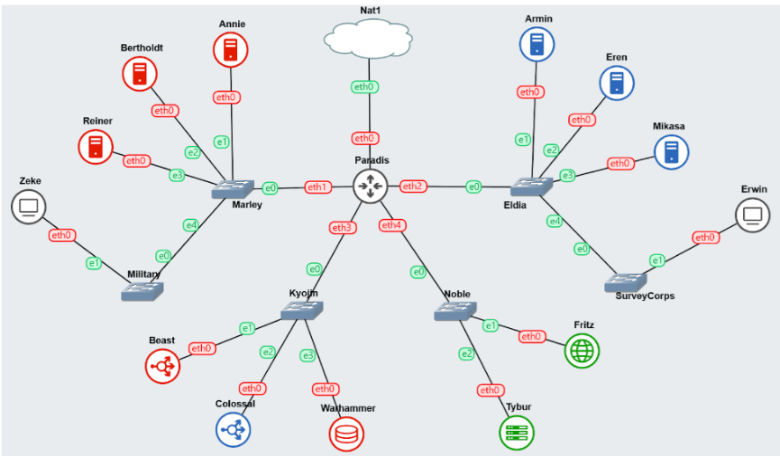

# Jarkom-Modul-3-IT13-2024

## Anggota Kelompok IT 13

| Nama Lengkap          | NRP        |
| --------------------- | ---------- |
| Muhammad Dzaky Ahnaf  | 5027231039 |
| Muhammad Nafi Firdaus | 5027231045 |

## Pendahuluan

Pulau Paradis dan Marley, sama-sama menghadapi ancaman besar dari satu sama lain. Keduanya membangun infrastruktur pertahanan yang kuat untuk melindungi sistem vital mereka. Dengan strategi yang matang, mereka bersiap menghadapi serangan dan mempertahankan wilayah masing-masing.

**Bangsa Marley**, dipimpin oleh **Zeke**, telah mempersiapkan **Annie**, **Bertholdt**, dan **Reiner** untuk menyerang menggunakan **Laravel Worker**. Di sisi lain, **Klan Eldia** dari Paradis telah mempersiapkan **Armin**, **Eren**, dan **Mikasa** sebagai **PHP Worker** untuk mempertahankan pulau tersebut. **Warhammer** bertindak sebagai **Database Server**, sementara **Beast** dan **Colossal** sebagai **Load Balancer**.

## Buat Topologi



## Konfigurasi IP

## Paradis Router (DHCP Relay)

```sh
auto eth0
iface eth0 inet dhcp

auto eth1
iface eth1 inet static
	address 10.70.1.1
	netmask 255.255.255.0

auto eth2
iface eth2 inet static
	address 10.70.2.1
	netmask 255.255.255.0

auto eth3
iface eth3 inet static
	address 10.70.3.1
	netmask 255.255.255.0

auto eth4
iface eth4 inet static
	address 10.70.4.1
	netmask 255.255.255.0
```

## Tybur (DHCP Server)

```sh
auto eth0
iface eth0 inet static
	address 10.70.4.2
	netmask 255.255.255.0
	gateway 10.70.4.1
```

## Fritz (DNS Server)

```sh
auto eth0
iface eth0 inet static
	address 10.70.4.3
	netmask 255.255.255.0
	gateway 10.70.4.1
```

## Warhammer (Database Server)

```sh
auto eth0
iface eth0 inet static
	address 10.70.3.2
	netmask 255.255.255.0
	gateway 10.70.3.1
```

## Beast (Load Balancer Laravel)

```sh
auto eth0
iface eth0 inet static
	address 10.70.3.3
	netmask 255.255.255.0
	gateway 10.70.3.1
```

## Colossal (Load Balancer PHP)

```sh
auto eth0
iface eth0 inet static
	address 10.70.3.4
	netmask 255.255.255.0
	gateway 10.70.3.1
```

## Annie (Laravel Worker)

```sh
auto eth0
iface eth0 inet static
	address 10.70.1.2
	netmask 255.255.255.0
	gateway 10.70.1.1
```

## Bertholdt (Laravel Worker)

```sh
auto eth0
iface eth0 inet static
	address 10.70.1.3
	netmask 255.255.255.0
	gateway 10.70.1.1
```

## Reiner (Laravel Worker)

```sh
auto eth0
iface eth0 inet static
	address 10.70.1.4
	netmask 255.255.255.0
	gateway 10.70.1.1
```

## Armin (PHP Worker)

```sh
auto eth0
iface eth0 inet static
  address 10.70.2.2
  netmask 255.255.255.0
  gateway 10.70.2.1
```

## Eren (PHP Worker)

```sh
auto eth0
iface eth0 inet static
	address 10.70.2.3
	netmask 255.255.255.0
	gateway 10.70.2.1
```

## Mikasa (PHP Worker)

```sh
auto eth0
iface eth0 inet static
	address 10.70.2.4
	netmask 255.255.255.0
	gateway 10.70.2.1
```

## Zeke (Client)

```sh
auto eth0
iface eth0 inet dhcp
```

## Erwin (Client)

```sh
auto eth0
iface eth0 inet dhcp

```

## Script .bashrc

## Soal 0

Pulau Paradis telah menjadi tempat yang damai selama 1000 tahun, namun kedamaian tersebut tidak bertahan selamanya. Perang antara kaum Marley dan Eldia telah mencapai puncak. Kaum Marley yang dipimpin oleh Zeke, me-register domain name **marley.yyy.com** untuk worker Laravel mengarah pada **Annie**. Namun ternyata tidak hanya kaum Marley saja yang berinisiasi, kaum Eldia ternyata sudah mendaftarkan domain name **eldia.yyy.com** untuk worker PHP **(0)** mengarah pada **Armin**.
